## Tartalomjegyzék

1. [Nem informált és informált, fa alapú keresési algoritmusok](#nem-informált-és-informált-fa-alapú-keresési-algoritmusok)
2. [Lokális keresésre épülő és populáció alapú algoritmusok](#lokális-keresésre-épülő-és-populáció-alapú-algoritmusok)
3. [Megoldáskeresés nemdeterminisztikus és ellenséges környezetben](#megoldáskeresés-nemdeterminisztikus-és-ellenséges-környezetben)
4. [Tételbizonyítás ítéletkalkulusban](#tételbizonyítás-ítéletkalkulusban)
5. [Elsőrendű logika és következtetési módszerei](#elsőrendű-logika-és-következtetési-módszerei)
6. [Lineáris regresszió és a gradient descent algoritmus](#lineáris-regresszió-és-a-gradient-descent-algoritmus)
7. [Osztályozás gépi tanulási módszerekkel](#osztályozás-gépi-tanulási-módszerekkel)
8. [Mesterséges neurális hálózatok számítási modellje és tanítása](#mesterséges-neurális-hálózatok-számítási-modellje-és-tanítása)

## Nem informált és informált, fa alapú keresési algoritmusok
Források:  
MI_02-Keresés.pdf
_________________
Ágens:  
„Cselekvő”  
- A szoftverágens más számítógépes programokhoz képest:  
    - Környezet észlelése, ahhoz való alkalmazkodás  
    - Tartós létezés és emlékezés  
    - Autonóm módon cselekszik  
    - Meghatározott célja van  
- Korlátozott racionalitás:  
    - Nincs idő minden lehetőséget, következményt kiszámítani  
    - A bejövő információk pontatlanok, hiányosak  
    - A legjobbnak tűnő döntést próbálja meghozni  

Vannak benne: érzékelők, beavatkozók, ágensfv., áganesprogram

Problémamegoldó ágens: A célorientált ágens típusa (cselekvéssorozat tervezése, kívánt állapot keresése az állapottérben)

- A környezet:
    - Diszkrét
    - Statikus
    - Determinisztikus
    - Megfigyelhető
    - Egyágenses
- A probléma modellezhető egy irányított gráffal
    - A csúcsok a környezet állapotai
        - A lehetséges állapotok ismertek (lehet végtelen számú)
        - Van egy kezdőállapot
        - Van egy célteszt függvény, ami eldönti, hogy egy állapot célállapot-e
    - Az élek a cselekvések
        - Ismert, hogy mely állapotban milyen lehetséges cselekvések vannak
        - Ismert, hogy milyen állapotba kerül a környezet egy cselekvés hatására
        - Ismert a cselekvések költsége (költségfüggvény)
    - A megoldás egy út a kezdőállapotból egy célállapotba
    - Az optimális megoldás a legkisebb összköltségű út

**NEM INFORMÁLT KERESÉS**  
MEGOLDÁSOK KERESÉSE
- Az állapottér szisztematikus bejárása
- Keresési fa felépítése
    - A kezdőállapot a gyökércsúcs
    - A szomszédos csúcsok az egy cselekvéssel elérhető állapotok csúcsai
    - A célállapotból a gyökérbe visszavezető út határozza meg a megoldáshoz tartozó cselekvéssort
    - Számon tartjuk a nyitott csúcsokat (amik még nem kerültek kifejtésre)
    - A redundáns (korábban már elért) állapotok csúcsait eldobjuk
- Egy csúcshoz az alábbi információkat tároljuk:
    - Állapot
    - Mutató a szülőre
    - Az ide vezető cselekvés
    - Eddigi összköltség

ÁLTALÁNOS KERESÉSI ALGORITMUS
- Nyitott csúcsok inicializálása a gyökércsúccsal (kezdőállapot)
- Amíg van nyitott csúcs:
    - Következő csúcs kiválasztása
    - Ha célállapot, akkor visszatérünk a megoldással
    - Csúcs kifejtése:
    - Minden lehetséges cselekvésre:
    - Új csúcs az elért állapottal
    - Költség kiszámítása
    - Hozzáadjuk a nyitott csúcsokhoz
- Ha nincs több nyitott csúcs, akkor nincs megoldás

KERESÉSI STRATÉGIÁK
- Melyik nyitott csúcs legyen a következő?
- A stratégia a megfelelő adatszerkezetet is meghatározza
    - Szélességi keresés – deque
    - Mélységi keresés – stack
    - Egyenletes költségű keresés – priority queue (heapq, queue.PriorityQueue)
- Stratégiák hatékonysága
    - Teljesség
    - Optimalitás
    - Időigény
    - Tárigény

SZÉLESSÉGI KERESÉS
- A legsekélyebb csúcsot választja
- Teljes, akár végtelen állapottér esetén is
- A legsekélyebb megoldást találja meg
    - Optimális, ha a cselekvések azonos költségűek
- Idő- és tárigénye: 𝑂(𝑏 a d-n)
    - b: elágazási tényező (branching factor)
    - d: célállapot mélysége
    - b=10, d=10, 1 millió csúcs/s, 1 KB/csúcs esetén 3 óra futási idő és 10 TB memóriaigény

MÉLYSÉGI KERESÉS
- A legmélyebb csúcsot választja
- Véges állapottérre teljes (ha megelőzzük a köröket)
    - Végtelen keresési fa esetén beragadhat egy végtelen ágba
- Nem biztos, hogy a legrövidebb cselekvéssorral jut el a megoldásig
- Ha az állapottérben nincs kör, akkor nem kell tárolni az összes megvizsgált csúcsot
    - Így a tárigénye 𝑂 𝑏𝑚 , ahol m a maximális mélység
    - Visszalépéses keresés: csak az aktuális csúcsot, és az odavezető lépéssort tároljuk – 𝑂 𝑚
- Iteratívan mélyülő mélységi keresés (IDDFS)
    - A végtelen fa megakadályozására egy mélységkorlátot vezetünk be
    - Ha nem talál megoldást, növeljük a korlátot és újraindítjuk
    - Így már végtelen állapottérre is teljes

EGYENLETES KÖLTSÉGŰ KERESÉS
- A legkisebb költségű csúcsot választja
- Teljes és optimális, feltéve hogy minden cselekvésnek pozitív költsége van
    - 0 költségű esetén végtelen ciklusba kerül
- Az idő- és tárigény nagyban függ a költségfüggvény és az állapottér jellegétől
    - De nem rosszabb a szélességi keresésnél
    - A csúcsok rendezett tárolása általában elhanyagolható többletet jelent
- Többszálú implementáció esetén szinkronizálni kell a várakozási sor

KÉTIRÁNYÚ KERESÉS
- Ha egy (vagy kevés) célállapot van, akkor egy párhuzamos keresést indítunk onnan is
- Ha a két irány találkozik, megvan a megoldás
- 𝑏^(𝑑/2) + 𝑏^(𝑑/2) sokkal kisebb mint 𝑏^𝑑
- Ismernünk kell, hogy egy állapotba mely állapotokból juthatunk el egy lépéssel
- Itt is többféle stratégia alapján választhatunk a nyitott csúcsokból és válthatunk az irányok között

**INFORMÁLT KERESÉS** 

Problémaspecifikus ismeretek segítségével hatékonyabban kereshetünk
- Heurisztika:
    - h(n) függvény
    - Becslés az aktuális csúcsból a célhoz vezető út költségére
    - Egy egyszerű mód heurisztika megadására egy relaxált probléma megoldása
        - Pl.: légvonalbeli távolság, akadályok nélküli távolság, Manhattan-távolság
- A becslés nem feltétlenül alsó/felső korlátja a tényleges hátralévő költségnek,
de jó, ha alsó korlátot ad (elfogadható heurisztika)
    - Dominancia: két elfogadható heurisztika közül a magasabb jobb (magasabb alsó korlát)
- Konzisztens heurisztika: egy cselekvés hatására h(n) legalább a cselekvés költségével 
csökken

MOHÓ KERESÉS
- A becslés alapján a megoldáshoz legközelebbi csúcsot választja
    - h(n) minimális
- Véges állapottérre teljes
- Nem optimális
- Komplexitása nagyban függ a heurisztika minőségétől

A* KERESÉS
- A legkisebb becsült összköltségű csúcsot választja
    - f(n) = g(n) + h(n) minimális, ahol g(n) az n csúcshoz vezető út költsége
- Teljes, ha minden cselekvésnek pozitív költsége van
- Optimális, ha a heurisztika konzisztens
- A komplexitás itt is nagyban függ a heurisztika minőségétől
    - Egy jó heurisztikának a kiértékelése is számításigényes lehet
    - Ha a gyorsaság fontosabb az optimalitásnál, szorozzuk be h(n)-t egy W>1 súllyal
        - Súlyozott A* algoritmus
        - Kevesebb csúcsot jár be, de ha W túl nagy, nem találja meg az optimális megoldást

A* MEMÓRIAKORLÁTOZÁSSAL
- Nyalábkeresés (beam search)
    - A nyitott csúcsok közül csak a legjobb k db-ot tároljuk
    - Alternatíva: a legjobb f(n) értéktől legfeljebb adott mértékben eltérőket: 𝑓 𝑛 < 𝛿 ⋅ min{𝑓 𝑛 }
- Iteratívan mélyülő A* keresés (IDA*)
    - Akár az IDDFS, csak mélység helyett f(n) értékére van korlát
- Recursive best-first search (RBFS)
    - Amikor visszalép a fában, törli az utoljára kifejtett csúcs gyerekeit,
    és f(szülő)-t a min{f(gyerek)}-re növeli
    - Javítja a becslést a továbblépéssel, de nem foglalja a memóriát, amíg van jobb alternatíva

RBFS példa: [kép]

## Lokális keresésre épülő és populáció alapú algoritmusok
Források:  
MI_03_Keresés_komplex_környezetben.pdf

LOKÁLIS KERESÉS – LOCAL SEARCH
- Csak az aktuális állapotot tárolja, az odavezető utat nem
    - Nem teljes, nem optimális
    - Kevés memóriát igényel
    - Alternatív célállapotok/megoldások között lépked, nem konstruktívan építi fel őket
- Sok feladatnál a lényeg a célállapot, az odavezető út könnyen előállítható
    - N-királynő probléma
    - Áramkörtervezés
    - Alaprajzkészítés
    - Ütemezés
    - Portfoliótervezés
- Olyan bonyolult feladatokra is jó megoldást tud adni, ahol a keresési tér túl nagy a kimerítő 
kereséshez 

LOKÁLIS KERESÉS KERETALGORITMUS  

Kezdeti megoldás előállítása  
- Ismétlés a végtelenségig vagy megállási feltételig:  
    - Szomszédos megoldások előállítása  
    - Legjobb szomszéd kiválasztása  
    - Ha a kiválasztott nem jobb a jelenlegi megoldásnál, akkor visszatérés a mostanival  
    - Aktuális megoldás cseréje a kiválasztottra  
- A megállási feltétel lehet:
    - Időkorlát
    - Iterációkorlát
    - Küszöbérték a javulás mértékére (abszolút vagy relatív)

HEGYMÁSZÓ ALGORITMUS
- Mohó lokális keresés
- Célfüggvényt maximalizál
    - Költségfüggvény előjelváltással
    - Származhat heurisztikából is
- Lokális maximumhelyen vagy fennsíkon áll le
    - Az állapotreprezentáció, a szomszédgeneráló 
    módszer és a célfüggvény megválasztása nagy 
    hatással van a hatékonyságra
- Variánsok:
    - Oldallépések a vállak kivédésére
    - Sztochasztikus hegymászó: a szomszédok értékeivel 
    arányos kiválasztási valószínűségek
    - First-choice: random generált szomszédokból az első 
    javító állapotot választja
    - Újraindítás véletlenszerű helyekről 

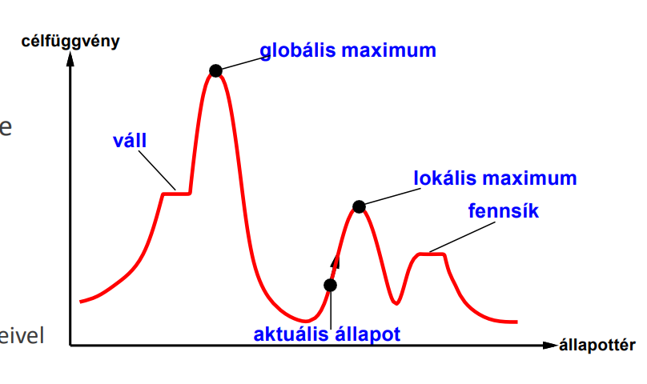

KIJUTÁS A LOKÁLIS OPTIMUMBÓL
- Szeretnénk elkerülni, hogy beragadjunk lokális maximumokba
    - A hegymászó algoritmus soha nem lép rosszabb megoldásra
    - Megoldás: metaheurisztika – globális keresési stratégia
- Metropolis algoritmus
    - A sztochasztikus hegymászó kiterjesztése: a rontó lépéseket is megengedi, de minél rosszabb egy 
    szomszéd, annál kisebb valószínűséggel lesz kiválasztva
- Szimulált hűtés (simulated annealing)
    - Ahogy a megmunkálandó fém, üveg hűl, egyre kevésbé rugalmas
    - Bevezetünk egy hőmérséklet változót, ami a futás során csökken, így egyre kisebb valószínűséggel 
    engedi a rontó lépéseket
- Tabu keresés
    - Az utolsó k állapotot megjegyzi egy tabu listában és kizárja a keresésből
    - A legjobb ki nem tiltott szomszédot választja, akkor is, ha az ront

POPULÁCIÓS ALGORITMUSOK
- Nem csak egy aktuális állapot van, hanem egyszerre több
- Az újraindításos módszertől abban különbözik, hogy a populáció egyedei között lehet 
kommunikáció, míg újraindításnál a keresések egymástól függetlenek
- Lokális nyaláb keresés
    - Minden egyed szomszédjait generálja, és a legjobb k egyedet választja ki
    - Sztochasztikus nyaláb keresés: az értékük szerinti valószínűséggel választ ki k új egyedet
- Evolúciós algoritmusok
- Az egyedek között információcsere történik
- Genetikus algoritmus:
    - Keresztezés/rekombináció/crossover: az állapotot leíró paraméterek (gének) kicserélődnek két kiválasztott szülő 
    között, így hozva létre új egyedet
    - Mutáció: random változtatások az állapotváltozókban
- Számos természet által inspirált evolúciós algoritmus jelent meg:
hangya kolónia, farkasfalka, méh kolónia, részecske raj 

LOKÁLIS KERESÉS FOLYTONOS ÁLLAPOTTÉRBEN
- Folytonos állapottérben kontinuum sok „szomszéd” lehet
- Diszkretizálható fix lépésközzel
    - A lépésköz dinamikusan változtatható is a keresés során
        - Például amíg javul a célfüggvény, addig növeljük
    - Egy lépésben csak egy változót módosítunk (vagy max. k-t)
- Gradiens módszerek:
    - A lépésköz a javítás mértékével arányos
    - A gradiens (meredekség) a lépés irányát is kijelöli
    - Ha a célfüggvény nem differenciálható, akkor empirikus gradiens számítható a lépéssel járó 
    javulásból

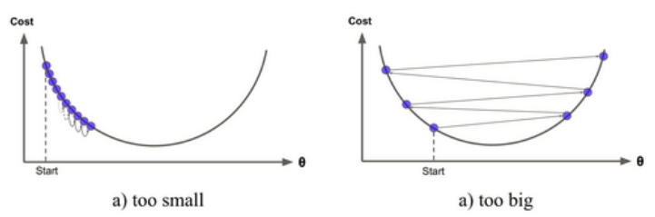
_________________

## Megoldáskeresés nemdeterminisztikus és ellenséges környezetben
Források:  
MI_03_Keresés_komplex_környezetben.pdf

HIÁNYOS INFORMÁCIÓK TÍPUSAI
- Nemdeterminisztikus működés
- Eddig feltételeztük, hogy tudjuk milyen állapotba kerülünk egy-egy cselekvés után
- Eshetőségi problémák: véletlenszerűen több lehetséges állapot egyikébe kerülhetünk
- Felderítési problémák: nem ismert előre az állapotátmeneti függvény
- Többágenses környezet
- Más ágensek cselekvései is hatással vannak az állapotra
- Játékelméleti módszerek (később)
- Nem megfigyelhető a teljes környezet
- A jelenlegi állapotot csak részben ismerjük

ESHETŐSÉGI PROBLÉMÁK
- Hiedelmi állapottér (belief-state space):
- Egy cselekvéssel nem egy konkrét állapotba kerülünk, hanem a lehetséges állapotok halmazába
- A valóságban csak az egyik állapotba, de a tervezésnél a teljes halmaz alkot egy hiedelmi állapotot
- A megfigyelés során derül ki, hogy melyik konkrét állapotba került az ágens
- Eshetőségi tervet kell készíteni
- A megoldás nem egy cselekvéssorozat, hanem feltételek és cselekvések sorozata
- Ha X akkor csináld Y-t
- A lehetséges állapotok közül nem az ágens választ
- Minden eshetőségre fel kell készülni

AND-OR FÁK
- A megismert keresési módszerek kis 
módosítással használhatóak
- A cselekvések közül választhatunk (OR)
- A lehetséges kimeneteleknél minden 
eshetőséget meg kell vizsgálni (AND)
- A megoldás nem egy út, hanem egy részfa lesz, 
ami az AND-csúcsoknál elágazik
- Minden levélcsúcsnak célállapotnak kell lennie
- A minimális költségű részfa az optimális
- Ha előfordulhat, hogy cselekvés után változatlan 
marad az állapot, akkor kör is lehet a megoldásban 

SZENZOR NÉLKÜLI PROBLÉMÁK
- A megfigyelhetőség szélsőséges esete, amikor semmilyen információnk nincs a 
környezet állapotáról (nem megfigyelhető)
- Ilyen helyzetben is lehet tervezni
- Ha ismerjük az összes lehetséges állapotot és a cselekvések hatásait
- A kezdeti hiedelmi állapot az összes állapotot tartalmazó halmaz
- Nincs megfigyelés, ezért nincsenek AND-csúcsok
- A hiedelmi állapottér determinisztikus, de gyakran túl nagyméretű a kimerítő kereséshez
- A megoldás egy olyan cselekvéssor, ami bármely állapotból célállapotba visz
- A hiedelmi állapottérben való keresés helyett használható inkrementális keresés:
Keresünk egy megoldást az 1. állapotból indulva, majd megnézzük, hogy érvényes megoldás-e a 2., 3., stb. 
állapotokból is (ha nem, folytatjuk az 1. állapotból történő keresést)

RÉSZLEGESEN MEGFIGYELHETŐ KÖRNYEZET
- A valós problémák általában a két véglet közt vannak: tudunk információt szerezni a 
szenzorokkal, de nem ismerjük az állapot minden részletét
- A megoldás az előző módszerek általánosítása:
- Vannak AND-csúcsok, de az ágak nem konkrét állapotok, hanem hiedelmi állapotok
- Nehéz olyan megoldást találni, ami minden eshetőségre jó
- Online keresés:
- Korlátozott mélységig keres és heurisztika alapján dönt
- A megfigyelés után új tervet készít
- Zsákutcába kerülhet, ha rossz úton indult el

**ELLENSÉGES KÖRNYEZET**

JÁTÉKELMÉLET
- A gazdaságtudomány egyik alterülete
- Gazdasági, politikai szereplők közti versengés modellezése
- Többágenses környezetek
- Az ágensek cselekvései hatással vannak egymásra, a környezetre
- Mind a saját célját próbálja elérni
- Kompetitív vagy kooperatív játékok: a célok egymással ellentétesek vagy átfedésben vannak
- Jobb racionális ágenseknek tekinteni a többi ágenst, mint nemdeterminisztikus 
környezeti hatásoknak
- Körökre osztott játékokat vizsgálunk
- A játékosok felváltva lépnek, de lehet időkorlát a lépésre

JÁTÉKOK MODELLJE
- S0: kezdőállapot
- ToMove(s): melyik játékos van soron s állapotban
- Actions(s): lehetséges lépések
- Result(s, a): milyen állapot áll elő a lépéssel (állapotátmeneti függvény)
- Determinisztikus vagy sztochasztikus
- Teljes információjú játékoknál a játékállapot minden eleme ismert a játékosok által
- Utility(s, p): hasznosság- vagy nyereségfüggvény, a végállapot értéke p számára
- Zéróösszegű játék: minden végállapotra az egyes játékosok nyereségeinek összege 0
- Ha az egyik győz (+1), a másik veszít (-1), döntetlen (0) esetén azonos hasznossá

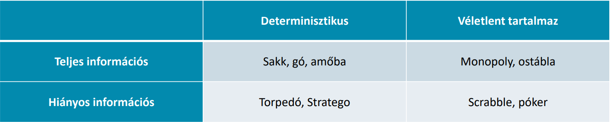

MINIMAX KERESÉS  
- Kétszemélyes zéróösszegű játékban a játékosok neve MIN (ellenfél) és MAX (én)
- Az ellenfél minimalizálni próbálja az eredményem, én maximalizálni
- Eshetőségi terv: AND-OR fa
- Minimax(s):
- Mi lesz az eredmény, ha mindkét játékos
optimálisan játszik?
- A végállapotokból visszafelé haladva
kiszámolható (mélységi bejárás)
- MIN csúcsokra a következő állapotok
értékeinek minimuma
- MAX csúcsokra az értékek maximuma
- Kiterjesztések:
- Több játékosra
- Véletlenszerű eseményekkel

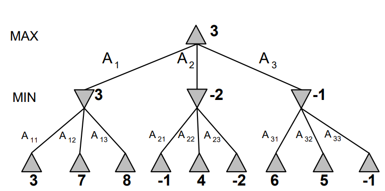

ALFA-BÉTA NYESÉS  
- Nyesés (pruning): a keresési fa egy részét nem járjuk be
- Ha egy csúcs egyik ágát kiértékeltük, a többi ágon ezt az értéket felhasználhatjuk 
korlátként
- Ha egy MAX csúcs egyik ágának értéke α, akkor a többi ágon lévő MIN csúcsok alatt 
elég egyetlen α-nál kisebb értékű csúcsot találni, akkor már nem azt az ágat fogjuk 
választani, így nem szükséges a tényleges minimumot kiszámolni
- Ha egy MIN csúcs egyik ágának értéke β, akkor a többi ágon lévő MAX csúcsok alatt 
elég egyetlen β-nál nagyobb…
- A sorrend is befolyásolja, hogy hány csúcsot kell megvizsgálnunk
- Érdemes olyan lépésekkel kezdeni, amik várhatóan a legjobbak az adott játékos számára

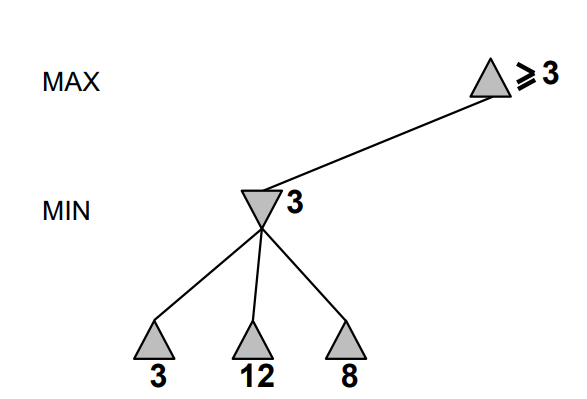

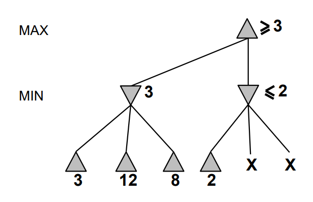

alfa_beta.py

HEURISZTIKUS ALFA-BÉTA KERESÉS
- Az alfa-béta nyesés csökkenti a keresési fa méretét, de az még így is túl nagy lehet
- Túl sok lehetséges lépés vagy rövid időkorlát
- Ötlet: hagyjunk ki több részt a keresési fából, akár az optimális megoldást veszélyeztetve
- Használjunk heurisztikát a köztes állapotok értékének becslésére
- Két fő stratégiai irány:
a) Limitáljuk, hány lépéssel előre tervezünk – az így elért csúcsok értékét heurisztikával becsüljük
Az iteratív mélyítéses keresésre hasonlít
b) A (becslés szerint) rossznak tűnő lépéseket, azok további ágait kihagyjuk a keresésből
A nyalábkeresésre hasonlít
- A játék elején inkább a heurisztikára hagyatkozunk, a végjátékban már kisebb a fa
- Hiányos információ vagy véletlenszerű eseményeknél is jól jön a heurisztika 

MONTE CARLO-FAKERESÉS (MCTS – MONTE CARLO TREE SEARCH)
- Nehéz jó heurisztikus kiértékelő függvényt találni, és a nagy elágazási tényezőt az se 
oldja meg
- Erre a kérdésre még visszatérünk a gépi tanulásnál
- Ötlet: szimuláljunk sok játszmát véletlenszerű lépésekkel, és elemezzük, hogy mely 
lépések teljesítettek jobban
- A szimulációkból egy hasonló fát építünk fel, és a csúcsokra kiszámoljuk a győzelmi 
arányt (vagy a várható nyereséget)
- A tiszta (pure) Monte Carlo-fakeresés a kezdőállapotból indulva mindig azonos 
valószínűséggel választ a lehetséges lépések közül
- Ennél hatékonyabb stratégia az, ha a jobbnak tűnő kezdeti lépéssornak több folytatását vizsgáljuk, 
mint a kevésbé ígéretes lépéssoroknak

IRÁNYÍTOTT SZIMULÁCIÓ
- Az MCTS algoritmus 4 lépést ismételget:
- Kiválasztás: a gyökérből indulva lehetséges lépéseket választunk, amíg olyan csúcshoz nem érünk, 
ami még nincs a fában
- Bővítés: hozzáadjuk a fához az újonnan elért csúcsot
- Szimuláció: további véletlenszerű lépésekkel befejezzük és kiértékeljük a játszmát
- Visszaterjesztés: az eredmény alapján frissítjük az új csúcshoz vezető úton lévő csúcsok értékeit
- A kiválasztás során két fő szempontunk van, melyeket egyensúlyban kell tartani:
- Felfedezés: a kevés szimulációban szereplő csúcsokról tudjunk meg több információt
- Kiaknázás: a legjobb győzelmi aránnyal rendelkező csúcsok információit pontosítsuk

UCT KIVÁLASZTÁSI STRATÉGIA
- UCT (Upper Confidence Bound 1 applied to Trees)
- Kocsis Levente, Szepesvári Csaba (2006)
- Az UCB1 (Auer et al., 2002) alkalmazása fakeresésre
- Kiválasztásnál minden csúcsból azt a lépést választjuk, amire az alábbi képlet értéke 
maximális:  
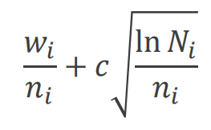  
𝑤𝑖 = a csúcsból a soron lévő játékos által elért győzelmek száma  
𝑛𝑖 = a csúcsból folytatódó összes szimuláció száma  
𝑁𝑖 = a szülő csúcsból folytatódó összes szimuláció száma  
𝑐 = felfedezési tényező (elméletben 2, a gyakorlatban   tapasztalati úton megválasztott) 
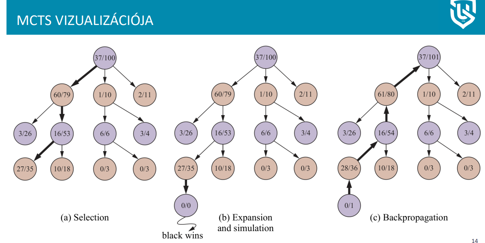
_________________

## Tételbizonyítás ítéletkalkulusban
Források:  
MI_05_Logikai_ágensek_ítéletkalkulus.pdf  

LOGIKA
- Keresés ≈ próbálgatás (virtuálisan)
- Láttuk, hogy a heurisztikák, a többletinformáció sokat segít a hatékonyságán
- Csak azokat a szabályokat „tudja”, amiket előre beleprogramozunk
- Nehezen kezeli a hiányos tudást
- Eddig az állapotok kapcsolatáról csak az állapotátmenetekből létrejövő gráfot ismerte az 
ágens, magasabb szintű, általános tudása nem volt a világról
- A döntési változók használata lehetővé teszi, hogy a változók kapcsolataira fogalmazzunk meg 
szabályokat
- Az eddigi módszerek (lokális keresés, evolúciós módszerek, matematikai programozás)
csak a kiértékeléshez és a szomszédok generálására használták fel őket
- A logika alapjait már az ókori görög filozófusok lefektették
- Logikai következtetéssel bővíthetjük a tapasztalati úton szerzett tudásunkat
- Ez a módszer közelebb áll az emberi gondolkodáshoz, mint a gépies próbálgatás, szimuláció 

TUDÁSBÁZISÚ ÁGENS
- Tudásbázis:
- Mondatok halmaza
- Mondat: tudásreprezentációs nyelven írt logikai (igaz-hamis) állítás
- Modellezi az ágens tudását, amit:
- Kezdetben beleprogramoztak (háttértudás)
- A jelenlegi környezetéről szerzett
- Kikövetkeztetett
- Következtető motor:
- Feladattól független, általános algoritmusok
- Lehetséges műveletei:
- Kijelent: megfigyelések alapján új mondat hozzáadása a tudásbázishoz
- Kérdez: a tudásbázis alapján megválaszolja a kapott kérdést 

LOGIKAI ÁLLÍTÁSOK
- A tudásbázis mondatai a tudásreprezentációs nyelv nyelvtani szabályait (szintaxisát) 
követik, azaz jól formált mondatok
- x + y = 4 jól formált
- x4y+ = nem jól formált
- A nyelv szemantikája definiálja a mondatok jelentését, igazságértékét az egyes 
lehetséges világokban (modellekben)
- x + y = 4 igaz abban a modellben, ahol x=2 és y=2, de hamis ott, ahol x=1 és y=1
- Az értéke minden modellre igaz vagy hamis
- A fuzzy logika ezt általánosítja 0 és 1 közötti igazságmértékre
- Ha α mondat igaz m modellben, akkor m kielégíti α-t, vagy modellje α-nak
- α modelljeinek halmaza: M(α)

- Ha egyik mondatból következik a másik, akkor köztük vonzat reláció van
- α-nak vonzata β, ha minden modellben, melyben α igaz, β is igaz, azaz M(α) ⊆ M(β)
- α igazsága tartalmazza β igazságát (magával vonzza)
- Jelölése: α ⊨ β

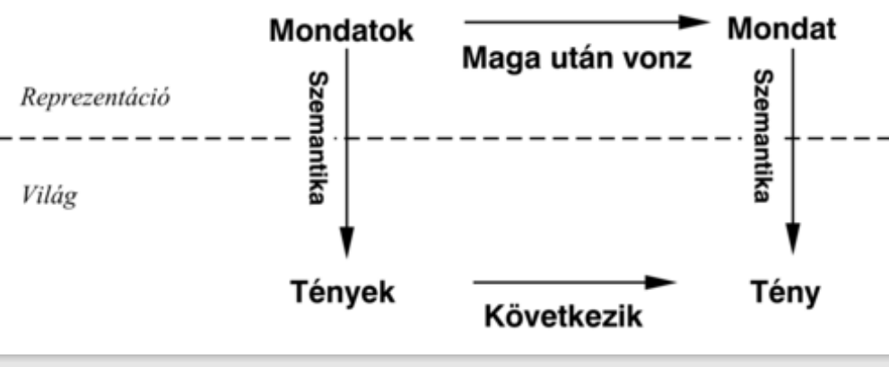

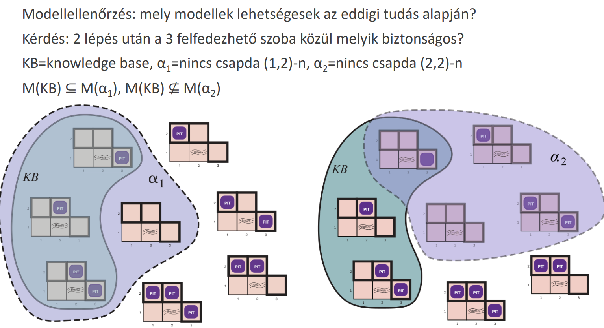

KÖVETKEZTETÉS (INFERENCIA)
- Olyan algoritmus, amely a tudásbázis mondataiból újabb mondatokat vezet le
- Ha csak vonzat mondatokat vezet le, akkor helyesnek vagy igazságtartónak nevezzük
- Ha minden vonzat mondatot levezet, akkor teljes is
- A modellellenőrzés a tudásbázis minden modelljére megvizsgálja a kérdéses mondat 
igazságtartalmát, hogy megállapítsa a vonzatot
- Véges számú modell esetén helyes és véges számú mondat esetén teljes is

ÍTÉLETLOGIKA SZINTAXISA
- Atomi mondatok, melyek igaz vagy hamis értéket jelölnek
- Pl.: W4,2 jelentése, hogy a wumpus (4,2)-n van
- Mondatok operátorai kiértékelési sorrendben:
- Zárójel: (A)
- Negáció: ¬A
- Literál: egy atomi mondat vagy a negáltja
- Konjunkció (és-kapcsolat): A ∧ B
- Diszjunkció (vagy-kapcsolat): A ∨ B
- Implikáció: A ⇒ B
- Ha A igaz, akkor B is igaz
- Ha A hamis, akkor B-ről nem tudjuk, hogy igaz-e
- A-t premisszának vagy előzménynek hívjuk, B-t konklúziónak vagy következménynek
- Ekvivalencia: A ⇔ B

TUDÁSBÁZIS PÉLDA
- Cx,y jelölje, hogy csapda van (x,y)-ban
- Sx,y jelölje, hogy szellő van (x,y)-ban
- Háttértudás:
- ¬C1,1
- S1,1 ⇔ (C1,2 ∨ C2,1)
- S2,1 ⇔ (C1,1 ∨ C2,2 ∨ C3,1)
- Érzékelés:
- ¬ S1,1
- S2,1
- Következtetés modellellenőrzéssel:
- Előállítunk minden modellt
- 7 atomi mondat, 27=128 modell
- Kiértékeljük bennük a tudásbázis mondatait
- 3-ban igaz mind az 5 mondat, tehát KB igaz
- Amelyikekben KB igaz, azokban kiértékeljük a 
kérdéses mondatokat
- Ami mindben igaz, az levezetésre kerül
- Ami mindben hamis, annak a negáltja kerül 
levezetésre

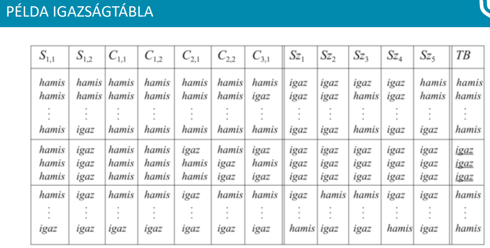

TÉTELBIZONYÍTÁS ÍTÉLETLOGIKÁBAN
- Ha sok lehetséges modell van, a modellellenőrzés nem hatékony
- A tételbizonyítás egy olyan következtetési mód, ami következtetési szabályokat és 
logikai azonosságokat használ fel, hogy új igaz mondatokat vezessen le a tudásból
- Fogalmak:
- Érvényes mondat (tautológia) az, ami minden modellben igaz
- Dedukcióelmélet: α ⊨ β akkor és csak akkor, ha az (α ⇒ β) mondat érvényes
- Egy mondat kielégíthető, ha van olyan modell, amiben igaz
- Meghatározása bizonyítottan NP-teljes
- Reductio ad absurdum (bizonyítás ellentmondás által): α ⊨ β akkor és csak akkor, ha az (α ∧ ¬β) 
nem kielégíthető
- Monotonitás: új információ megjelenésével csak bővülhet a tudásbázis

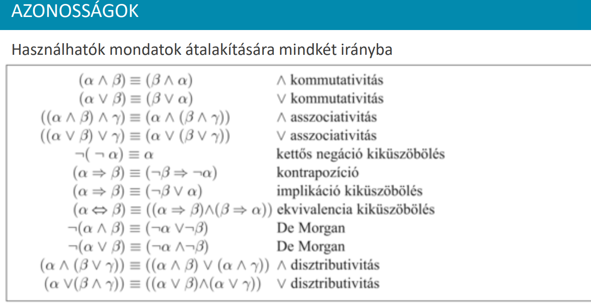

KÖVETKEZTETÉSI SZABÁLYOK
- Egyirányú átalakítást tesznek lehetővé
- Modus ponens:
- Ha α ⇒ β, és α mondat szerepel a tudásbázisban, akkor levezeti β mondatot
- És-kiküszöbölés:
- Ha szerepel az α ∧ β mondat, akkor levezeti α mondatot

PÉLDA
S1,1 ⇔ (C1,2 ∨ C2,1)
Ekvivalencia kiküszöbölés után: (S1,1 ⇒ (C1,2 ∨ C2,1)) ∧ ((C1,2 ∨ C2,1) ⇒ S1,1)
És-kiküszöbölés után: ((C1,2 ∨ C2,1) ⇒ S1,1)
Kontrapozíció alkalmazása után: (¬S1,1 ⇒ ¬(C1,2 ∨ C2,1))
¬S1,1 érzékelés alapján, ezért Modus Ponens után: ¬(C1,2 ∨ C2,1)
De Morgan-szabály alapján: ¬C1,2 ∧ ¬C2,1
Tehát (1,2)-ben és (2,1)-ben sincs csapda

REZOLÚCIÓS SZABÁLY
- Az előbbi szabályok alkalmazásával a következtetés helyes, de nem teljes
- Egységrezolúció:
- Ha α1 ∨ α2 ∨ … ∨ αk mondat és ¬αi
szerepelnek a tudásbázisban, akkor levezeti
α1 ∨ … ∨ αi-1 ∨ αi+1 ∨ … ∨ αk mondatot
- ¬αi és αi
fordítva is szerepelhetnek a két mondatban
- Pl.: C1,1 ∨ C2,2 ∨ C3,1 és ¬C1,1 , akkor C2,2 ∨ C3,1 , majd kiderül, hogy ¬C2,2 , akkor marad C3,1
- Rezolúció általánosan:
- Ha α1 ∨ α2 ∨ … ∨ αk mondat és β1 ∨ … ∨ ¬αi ∨ … ∨ βn mondat szerepelnek, akkor levezeti
α1 ∨ … ∨ αi-1 ∨ αi+1 ∨ … ∨ αk ∨ β1 ∨ … ∨ βn mondatot

KONJUNKTÍV NORMÁL FORMA (CNF)
- Minden ítéletkalkulus mondat átalakítható literálok diszjunkcióinak konjunkciójára
- A diszjunkciókat klózoknak (clauses) is nevezik
- k-CNF: minden diszjunkcióban k literál van
- Minden mondat átalakítható 3-CNF mondattá
- Átalakítás:
- Az ekvivalencia kiküszöbölés eltünteti az ⇔ relációkat (⇒ lesz belőlük)
- Az implikáció kiküszöbölés eltünteti az ⇒ relációkat (∨ lesz belőlük)
- A De Morgan-azonossággal bevihető a negálás a zárójelen belülre (csak literál lehet negálva a CNF-ben)
- Rezolúciós következtetés:
- Ahhoz, hogy levezessük α mondatot a tudásbázisból, hozzáadjuk ¬α klózt, és ha rezolúcióval 
ellentmondásra jutunk, akkor α-t levezettük
- Üres klóz = ellentmondás, mert a diszjunkció legalább 1 elemének igaznak kell lennie
- Ez a következtetési módszer CNF-ben lévő tudásbázisra helyes és teljes

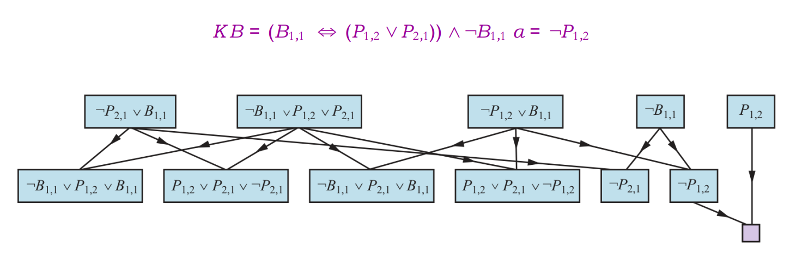

HORN-KLÓZOK
- A CNF egy speciális esete
- Minden klózban legfeljebb 1 literál pozitív, a többi negált
- Határozott (definite) klózok: pontosan 1 pozitív literál
- Implikáció formában: (pozitív literálok konjunkciója) ⇒ egyetlen pozitív literál
- „Ha X és Y és Z, akkor Q” formájú állítások
- A 0 pozitív literált tartalmazó klózok integritás korlátozások vagy célklózok:
- ¬(A ∧ B ∧ C) = ¬A ∨ ¬B ∨ ¬C: nem fordulhat elő, hogy egyszerre A és B és C
- Horn-klózokból álló tudásbázisban a magával vonzás eldöntésének komplexitása 
lineárisan arányos a mondatok számával
- Előrefelé vagy hátrafelé láncolás algoritmussal

forward_chaining.py

BACKWARD CHAINING
- Az előrefelé láncolás adatvezérelt, a hátrafelé láncolás célvezérelt
- A q célból indulunk ki
- Ha q bizonyítottan igaz, return True
- Különben minden olyan klózra, aminek következménye q, rekurzívan bizonyítjuk a 
premisszájában lévő szimbólumokat
- Amit bizonyítottunk, azt megjegyezzük
- Ha elakadunk, akkor q hamis

DPLL ALGORITMUS
- Davis & Putnam (1960), Davis & Logemann & Loveland (1962)
- CNF tudásbázisra (nem csak Horn-klózok esetén) működik
- Teljes visszalépéses algoritmus
- Kielégíthetőséget vizsgál
- A modellellenőrzés hatékonyabb megvalósítása
- Korai leállás
- Egy klóz igaz, ha bármelyik literál igaz
- Egy mondat hamis, ha bármelyik klóz hamis
- Tiszta szimbólum heurisztika
- Olyan szimbólumok, melyek minden klózban azonos előjelűek
- Ha egy mondat kielégíthető, van olyan modellje, melyben a tiszta szimbólumok literáljai igazak
- Egységklóz heurisztika
- Ha egy klóz egyelemű, akkor értéket rendel a szimbólumhoz
- Ha egy literál hamis, törli a klózból
- Implementációs trükkök

LOKÁLIS KERESÉSRE ÉPÜLŐ MEGOLDÓ
- WalkSAT algoritmus
- Célfüggvény: kielégítetlen klózok számának minimalizálása
- Szomszédok generálása: egy kielégítetlen klóz egyik szimbólumának negálása a 
jelenlegi megoldásban
- Stratégia: váltakozik a legjobb szomszéd és a random szomszéd kiválasztása
- Nem teljes, de ha van megoldás, általában gyorsan megtalálja

KIELÉGÍTHETŐSÉGI PROBLÉMÁK NEHÉZSÉGE
- Alulkorlátozott (alulhatározott) a probléma, ha a szimbólumok számához képest 
kevés a kielégítendő klóz
- Sok megoldás, könnyű beletrafálni
- Túlkorlátozott: ha sok a klóz, sok az információ a következtetéshez
- Gyors ellentmondás vagy bizonyítás
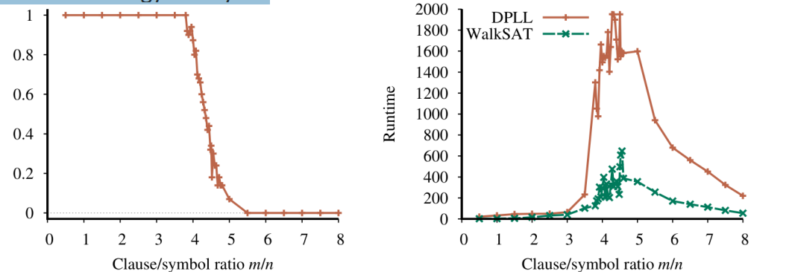
_________________

## Elsőrendű logika és következtetési módszerei
Források:  
MI_06_Elsőrendű_logika.pdf  

MOTIVÁCIÓ
- Az ítéletkalkulus szintaktikája túl egyszerű komplex, valós rendszerek leírásához
- Csak igaz/hamis értékű predikátumszimbólumokat tartalmaz
- Strukturált nyelvre van szükség
- A természetes nyelvek is strukturáltan reprezentálják a tudást
- Az állítások önmagukban is értelmes elemekből állnak:
- Főnevek
- Melléknevek
- Igék

ELSŐRENDŰ LOGIKA SZINTAXISA
Szimbólumok:
- Objektumok (konstansok)
- A tárgyterület (domain) az összes objektum 
halmaza
- Relációkat jelölő predikátumszimbólumok 
(állítások)
- Objektumok rendezett n-eseiből álló halmazok
- Egy bináris reláció egy rendezett párokból álló 
halmaz
- Az unáris relációk (tulajdonságok) halmazai 
objektumokat tartalmaznak
- Függvények: leképezések egy vagy több 
objektumról egy objektumra
Mondatok:
- Atomi mondatok: predikátumszimbólumok 
és az argumentumaik (objektumok vagy 
függvények) felsorolása
- Összetett mondatok: mondatok és logikai 
operátorok (¬, ∧, ∨, ⇒, ⇔)
- Kvantorok:
- Univerzális kvantor (minden változóra igaz, 
hogy…): ∀változók mondat
- Egzisztenciális kvantor (van olyan változó, amire 
igaz, hogy…): ∃változók mondat
- A mondatokban szerepelnek a változók az 
objektumok helyén
- Egyenlőség (objektumok között)

PÉLDA: OROSZLÁNSZÍVŰ RICHÁRD ÉS JÁNOS KIRÁLY
Objektumok: Richárd, János, Korona, 
Richárd bal lába, János bal lába
Relációk:
Bináris:
Testvér: {(Richárd, János), (János, Richárd)}
Fején: {(János, Korona)}
Unáris:
Személy: {Richárd, János}
Király: {János}
Korona: {Korona}
Függvények: BalLáb, Fivére 

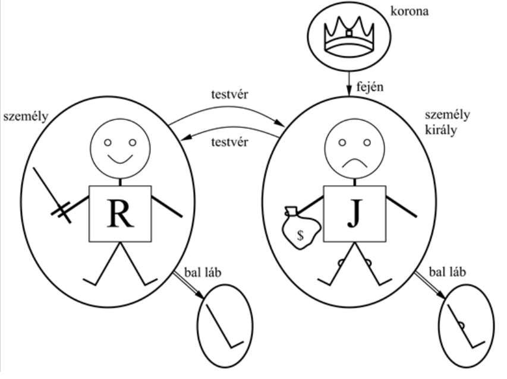

Példa mondatok:
Testvér(Richárd, János)
Király(Fivére(Richárd))
Király(Richárd) ∨ Király(János)
∀x Király(x) ⇒ Személy(x)
Nem így: ∀x Király(x) ∧ Személy(x)
∃x Korona(x) ∧ Fején(x, János)
Nem így: ∃x Korona(x) ⇒ Fején(x, János)
∀x,y Testvér(x, y) ⇔ Testvér(y, x)
∀x Király(x) ⇒ (∃y Korona(y) ∧ Fején(y, x))
Fivére(Richárd) = János
∀x Korona(x) ∨ Személy(x) ∨ ∃y BalLáb(x) = y

ELSŐRENDŰ LOGIKA, MINT TUDÁSBÁZIS
- Ahogy a predikátumlogikában, a szabályokat mondatok kijelentésével adjuk a 
tudásbázishoz
- Kérdezéssel lekérdezhetjük, hogy egy mondat igaz-e a tudásbázis alapján
- A változó-lekérdezés azt is megmondja, mely objektumok helyettesíthetőek be az 
egzisztenciális kvantorok változóiba, hogy igaz legyen a mondat
- A válasz a lehetséges behelyettesítési listák halmaza
- Pl.: ∃x,y Személy(x) ∧ Testvér(x, y) megoldása {{x/János, y/Richárd}, {x/Richárd, y/János}

REDUKÁLÁS ÍTÉLETLOGIKÁRA
- Univerzális példányosítás
- ∀ kvantorok eltüntethetőek, ha behelyettesítve a változókba új mondatokat generálunk
- Példa: ∀x Király(x) ∧ Mohó(x) ⇒ Gonosz(x)
- Király(János) ∧ Mohó(János) ⇒ Gonosz(János)
- Király(Richárd) ∧ Mohó(Richárd) ⇒ Gonosz(Richárd)
- Király(Apja(János)) ∧ Mohó(Apja(János)) ⇒ Gonosz(Apja(János))
- ...
- Egzisztenciális példányosítás
- ∃ kvantorok eltüntethetőek egy új konstans szimbólum bevezetésével
- Példa: ∃x Korona(x) ∧ Fején(x, János)
- Korona(C1) ∧ Fején(C1, János)
- A kapott mondat nem ekvivalens az eredetivel, de a csere utáni tudásbázis pontosan akkor kielégíthető, 
ha az eredeti is az

VÉGTELEN BEHELYETTESÍTÉS
- A függvények végtelenszer alkalmazhatóak
- Király(János) ∧ Mohó(János) ⇒ Gonosz(János)
- Király(Apja(János)) ∧ Mohó(Apja(János)) ⇒ Gonosz(Apja(János))
- ...
- Végtelen új mondatot generálhatunk
- Herbrand tétele: ha egy mondat kikövetkeztethető az elsőrendű tudásbázisból, akkor 
van olyan bizonyítás, ami egy véges részhalmazát használja fel az ítéletkalkulusra 
redukált tudásbázisnak
- Megoldás: iteratívan mélyítjük a függvények alkalmazását, míg be nem bizonyítjuk a 
kérdéses mondatot
- Probléma: ha a mondat nem vonzata a tudásbázisnak, a folyamat nem ér véget
- Elsőrendű logikában a vonzat meghatározása egy félig eldönthető feladat (Church–Turing tézis)

ÁLTALÁNOSÍTOTT MODUS PONENS
- Határozott (definite) klózoknál használható
- Modus ponens ítéletlogikában: ha α ⇒ β, és α∈TB, akkor β hozzáadása TB-hez
- Általánosítva elsőrendű logikára:
- Ha létezik olyan behelyettesítés, amelyet elvégezve az a ∧ b ∧ c ∧ … ⇒ q implikációra és a’, b’, c’, … atomi 
mondatokra, azonos mondatokat kapunk, akkor a q-ba való behelyettesítés vonzata a tudásbázisnak
- Az ilyen behelyettesítést egyesítő behelyettesítésnek, egyesítésnek nevezzük
- Példa:
- ∀x Király(x) ∧ Mohó(x) ⇒ Gonosz(x)
- Király(János)
- ∀y Mohó(y)
- A fenti tudásbázisból x/János, y/János behelyettesítéssel kikövetkeztethető Gonosz(János)
- Így nem kell olyan felesleges mondatokat generálni, mint Mohó(Richárd)

ELŐREFELÉ LÁNCOLÁS
- Határozott klózokból (ha x akkor y szabályokból) álló tudásbázis esetén
- Egyesítő behelyettesítéseket keresünk
- NP-nehéz feladat, de a klózok általában kicsik
- Implementációs trükkökkel, heurisztikákkal lehet növelni az átlagos hatékonyságát
- Az általánosított modus ponenst felhasználva új érvényes mondatokat generálunk
- Ha nincsenek függvények, vagy limitáljuk az alkalmazásuk számát, akkor a 
komplexitás csak a tudásbázis méretétől függ, azzal polinomiálisan arányos
- A klózok méretét konstansnak tekintjük

ELŐREFELÉ LÁNCOLÁS PÉLDA
A törvény kimondja, hogy bűntény az, ha egy amerikai polgár fegyvert ad el egy 
Amerikával ellenséges nemzetnek.
Nono egy ország, amely ellensége Amerikának, fel van szerelve rakétákkal, és ezeket a 
rakétákat mind West ezredes adta el nekik, aki amerikai.
Bizonyítsuk, hogy West bűnöző!

PÉLDA TUDÁSBÁZISA
- „…bűntény az, ha egy amerikai polgár fegyvert ad el egy Amerikával ellenséges nemzetnek”:
- ∀x,y,z Amerikai(x) ∧ Fegyver(y) ∧ Ellenséges(z) ∧ Elad(x, z, y) ⇒ Bűnöző(x)
- „Nono… fel van szerelve rakétákkal”:
- ∃x Birtokol(Nono, x) ∧ Rakéta(x)
- Egzisztenciális példányosítás után, R konstans bevezetésével: Birtokol(Nono, R) ∧ Rakéta(R)
- „És ezeket a rakétákat mind West ezredes adta el”:
- ∀x Rakéta(x) ∧ Birtokol(Nono, x) ⇒ Elad(West, x, Nono)
- Tudjuk, hogy a rakéták fegyverek:
- ∀x Rakéta(x) ⇒ Fegyver(x)
- Amerika ellensége „ellenségesnek” számít:
- ∀x Ellensége(x, Amerika) ⇒ Ellenséges(x)
- „West ezredes…, aki amerikai”:
- Amerikai(West)
- „Nono egy ország, amely ellensége Amerikának…”:
- Ellensége(Nono, Amerika)

ELŐREFELÉ LÁNCOLÁS PÉLDA
- ∀x Rakéta(x) ⇒ Fegyver(x) x/R
- ∀x Rakéta(x) ∧ Birtokol(Nono, x) ⇒ Elad(West, x, Nono) x/R
- ∀x Ellensége(x, Amerika) ⇒ Ellenséges(x) x/Nono

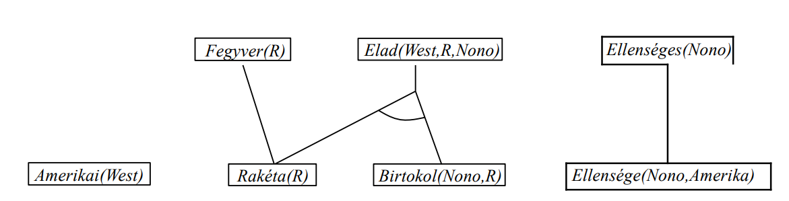

∀x,y,z Amerikai(x) ∧ Fegyver(y) ∧ Ellenséges(z) ∧ Elad(x, z, y) ⇒ Bűnöző(x)
x/West, y/R, z/Nono

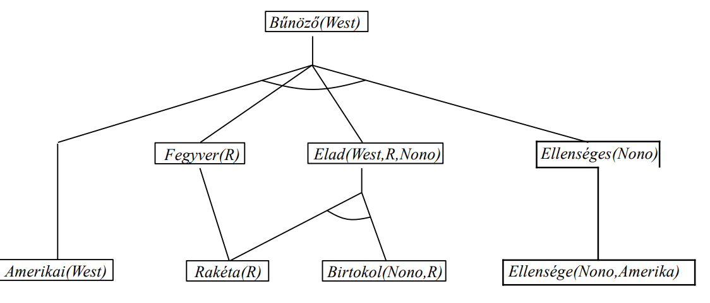

HÁTRAFELÉ LÁNCOLÁS
- Ahogy az ítéletkalkulusban, elsőrendű logikában is megfordítható a keresés iránya
- A célmondatból indulunk ki, és a premisszákból új részcélokat generálunk
- Mélységi kereséssel ekvivalens
- Végtelen ciklusba kerülhet, kördetektálással megelőzhető
- A rekurzív keresés sok ismétlődő részcélt generálhat, ezért érdemes memóriában tárolni a már 
megvizsgált részcélokat, de ez növeli a tárigényt
- Ezt a módszert alkalmazzák a logikai programozásban, például a Prolog

- Hasonlóan az ítéletkalkulushoz, az elsőrendű logikai tudásbázis CNF-re alakítható
- A rezolúciós szabály általánosításában egyesítő hozzárendelést alkalmazunk
- Példa:
- [Állat(F(x)) ∨ Szereti(G(x), (x))] és [¬Szereti(u, v) ∨ ¬Megöli(u, v)]
- u/G(x), v/x
- [Állat(F(x)) ∨ ¬Megöli(G(x), x)]
- Nem teljes, lásd Gödel nemteljességi tételeit
_________________

## Lineáris regresszió és a gradient descent algoritmus
Források:   
MI_09_Linreg_BMETE47MC38_2019_2020_1_Ea_6_Regresszio.pdf  
MI_09_01_simple_regr.ipynb  
MI_09_02_multiple_regr.ipynb

A regresszióelemzés céla
- Ha két változó együttjár, az egyiknek az értékéből meg 
lehet jósolni a másiknak az értékét. 
- A modell egy vagy több prediktor (magyarázó) változóból 
jósolja meg az eredmény (outcome) értékét 
- Egyváltozós regresszió: egy prediktor
- Többváltozós regresszió: több prediktor
- Eredmény is és prediktorok is skála vagy folyamatos ordinális 
típusúak (Nominális változókhoz logisztikus regresszióelemzés kell)

Egyváltozós regresszió
- A modell alapja:
Eredmény = (modell) + hiba
- A modell lineáris.
- A regressziós egyenes írja le, amit a 
legkisebb négyzetek módszerrel illesztünk.

A regressziós egyenes
• Egy egyenes definiálásának elemei:
- Az egyenes meredeksége (b)
- A pont ahol az egyenes az y tengelyt átszeli: intercept (a)
Eredmény = (modell) + hiba ==>
Y▿i = (intercept + bX▿i) + ε▿i (▿ az jelölésképpen van itt, hogy kisebb a szöveg, itt az i 1, 2, 3...  szerepét tölti be, vagyis Y1, Y2, Y3..)
• az intercept és b a regressziós együtthatók
• b írja le a modell meredekségét
• az intercept helyezi el a modellt a térben
• ε▿i a hiba: az i személy megjósolt és a valóságban megfigyelt 
értékei közötti különbség.
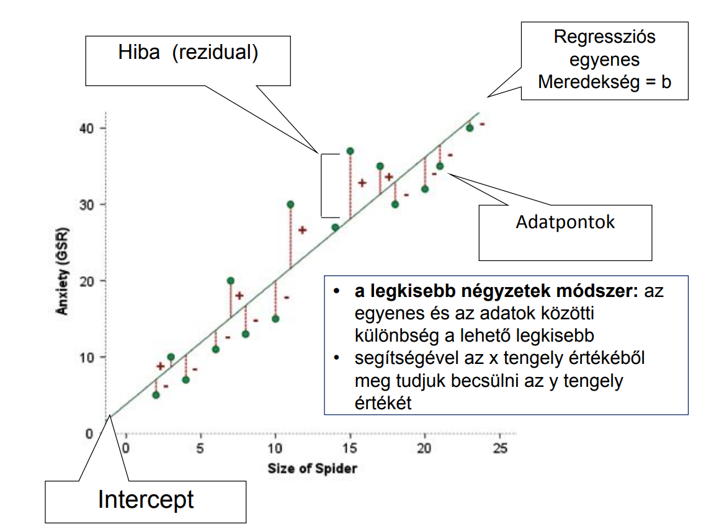

Milyen pontos a modell?
- goodness of fit: mennyivel jósolja meg jobban a 
modell az y értékét, mintha egyszerűen csak az 
átlagot használnánk = mennyivel csökkenti a modell 
a teljes varianciát.
- Üzleti példa: mivel lehet növelni az eladások számát? 
(AlbumSales.csv):
- Mennyivel több lemezt ad el a cég, ha 100,000 fonttal növeli 
a reklámra költött pénzt?
- Ha nincs információnk a reklámköltés és a lemezeladások 
kapcsolatáról, a legjobb becslésünk az eladások átlagos 
száma.

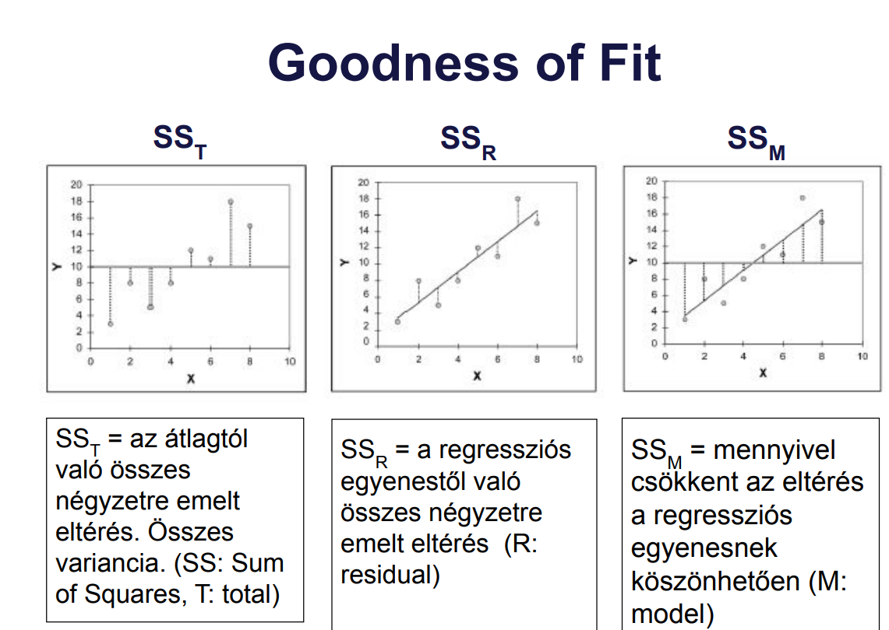

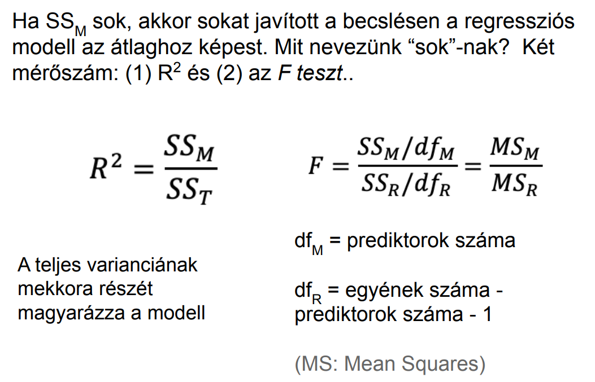

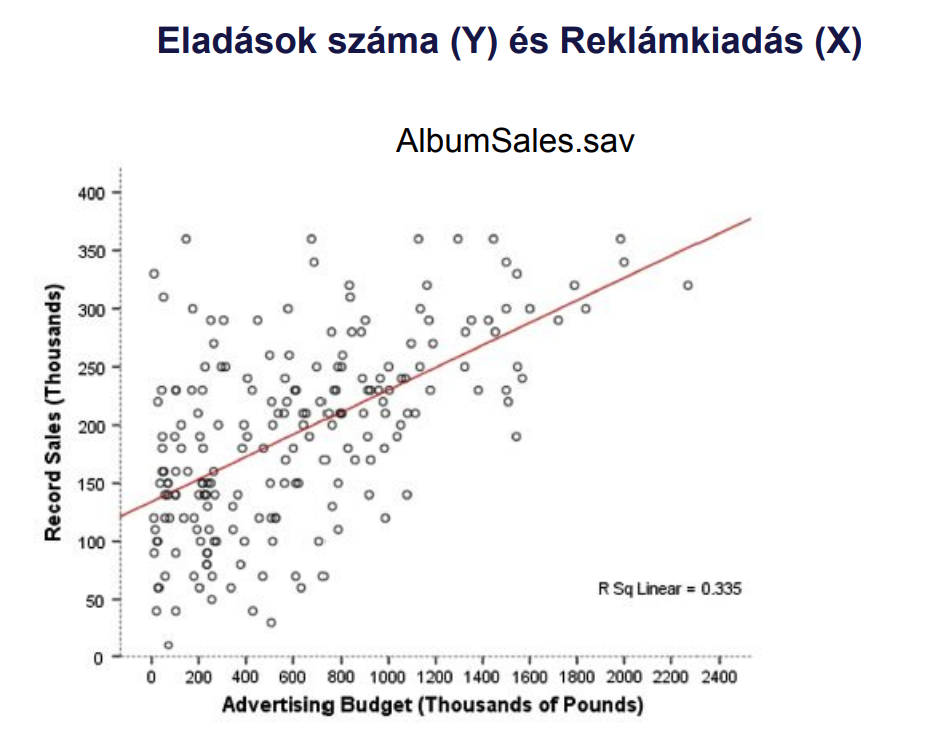

JASP
Regression > Linear Regression
Dependent variable: Eredményváltozó
Covariates: Prediktorok
Statistics:
Estimates: együtthatók
Model fit: F érték (ANOVA)

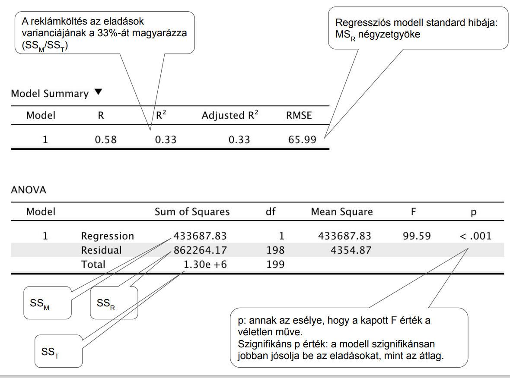

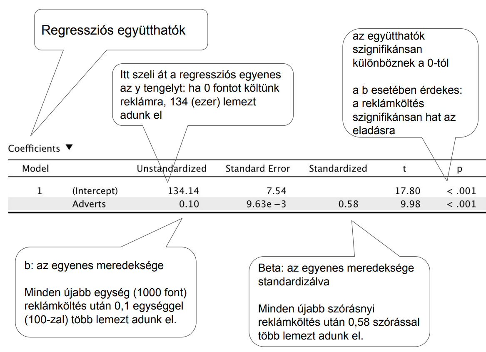

A modell használata a gyakorlatban
Mivel a modell szignifikáns (megbízható), megjósolhatjuk 
belőle az eladások számát a reklámköltés ismeretében:
eladás = intercept + b x
 reklámköltés
 = 134,14 + (0,1 x
 reklámköltés)
Hány lemezt fogunk eladni, ha 500 ezer fontot költünk 
reklámra?

Többváltozós regresszió
• AlbumSales.csv - további magyarázó változók:
•reklámköltés
•hány órát játszák a számokat a rádióban
•milyen vonzó a zenész ( 1-től 10-ig 
terjedő skálán

A többváltozós modell
• Egy eredmény változó (skála vagy ordinális)
• Két vagy több prediktor (skála vagy ordinális)
• A modell:
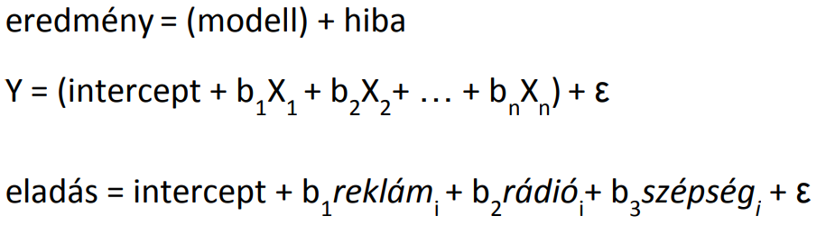

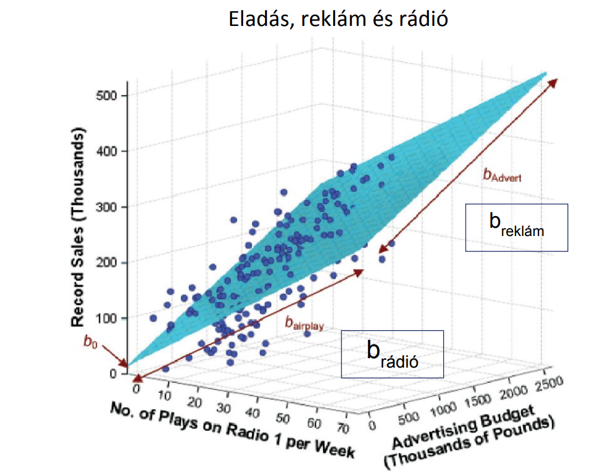

A variancia felosztása
Az eredményváltozó varianciája
- a prediktorok hatásából
- + a megmaradt hibából
tevődik össze.
A probléma: a prediktorok hatásai nem 
feltétlenül különülnek el egymástól 
(egymással is korrelálnak): Kovariancia

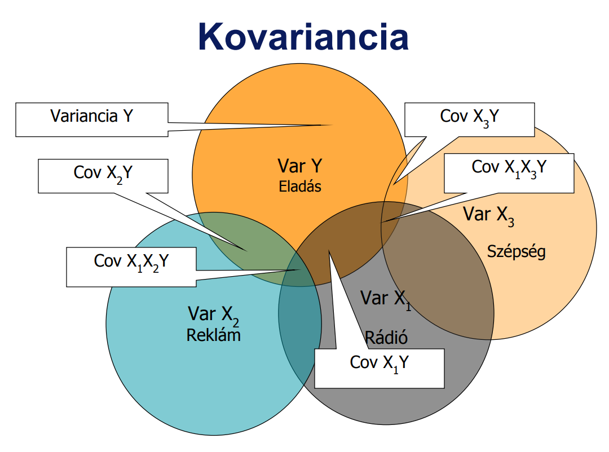

Parciális és szemiparciális 
korreláció
•Parciális: Egy prediktor saját hatása az 
eredményváltozóra minden más prediktor 
hatásának kiszűrésével.
•Szemiparciális: Egy prediktor saját hatása a többi 
prediktor hatásán felül. 
- Többváltozós regresszióban: amikor új 
prediktort adunk a modellhez, az előző 
prediktoron hatásán felüli hatást látjuk.

Modellépítés
• Prediktorok kiválasztása
– Hipotézis szerint (nem összevissza!)
– Ha túl sok a prediktor, értelmezhetetlen lesz a modell.
– Ha a prediktorok erősen korrelálnak egymással, 
használhatatlan lesz a modell.
• A modell felépítése
– Jobb kisebb modellel kezdeni
– Fokozatosan bővíteni

Modellépítés módszerei
• Enter
– Minden prediktor egyszerre kerül a 
modellbe.
• Hierarchikus Enter 
– Több modell egymás után, egyre több 
prediktorral.
– Először a hipotézis szerint a legerősebb 
hatású prediktor, azután a várhatóan 
kevésbé erős hatásúak

Forward módszer (lényegében a hierarchikus 
Entry módszer automatikus változata)
1. A szoftver kiválasztja azt a prediktort, ami a 
legerősebben korrelál a outcome-mal.
2. További prediktorokat aszerint választja, hogy 
milyen erős a szemiparciális korrálációjuk az 
outcome-mal. Erősebb előbb.
3. Addig folytatja, amíg nem marad olyan prediktor, 
ami szignifikánsan korrelál az outcome-mal.

Backward módszer
1. A szoftver az összes prediktort beteszi a 
modellbe, és kiszámolja a hatásukat.
2. Kiveszi azokat a prediktorokat, amiknek a hatása 
egy adott szint alatt van. 
3. Addig folytatja, amíg a valamennyi modellben 
maradt prediktornak szignifikáns hatása van.

Stepwise módszer
A Forward és Backward kombinációja:
1. A szoftver egyenként adja a modellhez a 
prediktorokat.
2. Minden lépés után leteszteli, hogy a modell 
valamennyi prediktora szignifikáns-e.
3. Ha valamelyik prediktor már nem szignifikáns, 
kiveszi a modellből.

Feltételek
• Kolinearitás: A prediktorok ne korreláljanak 
egymással túl erősen 
• Pontdiagramokkal, korrelációval ellenőrizhető
• A VIF (variance inflation factor) értékkel is tesztelhető: Ne 
nagyon legyen 8 fölött (Statistics > Collinearity diagnostics)
• A residuumok normál eloszlást mutassanak
• JASP: Plots > Residuals vs. histogram
• Vagy Residuals > Casewise diagnostics: Kiadja a megadott z 
értéknél távolabb lévő reziduumokat
• Kiugró értékeket törölni vagy együtthatók bootstrapping 
módszerrel (Regression Coefficients > Estimates > From 
[1000] bootstraps)

• Homoszkedaszticitás: a reziduumok ne 
kövessen mintázatot
• Plots > Residuals vs. predicted
• Független hibák: A reziduumok ne 
korreláljanak 
• Residuals > Durbin-Watson, értéke 0 és 4 
között. 2: nincs korreláció, 4 erős negatív 
korreláció, 0 erős pozitív korreláció

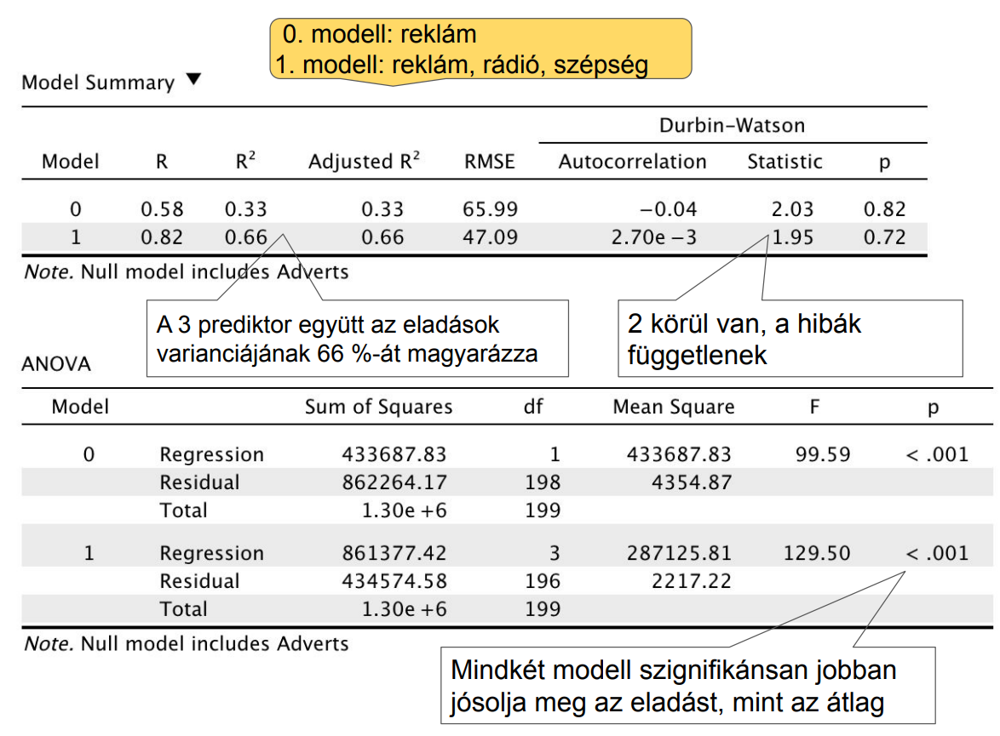

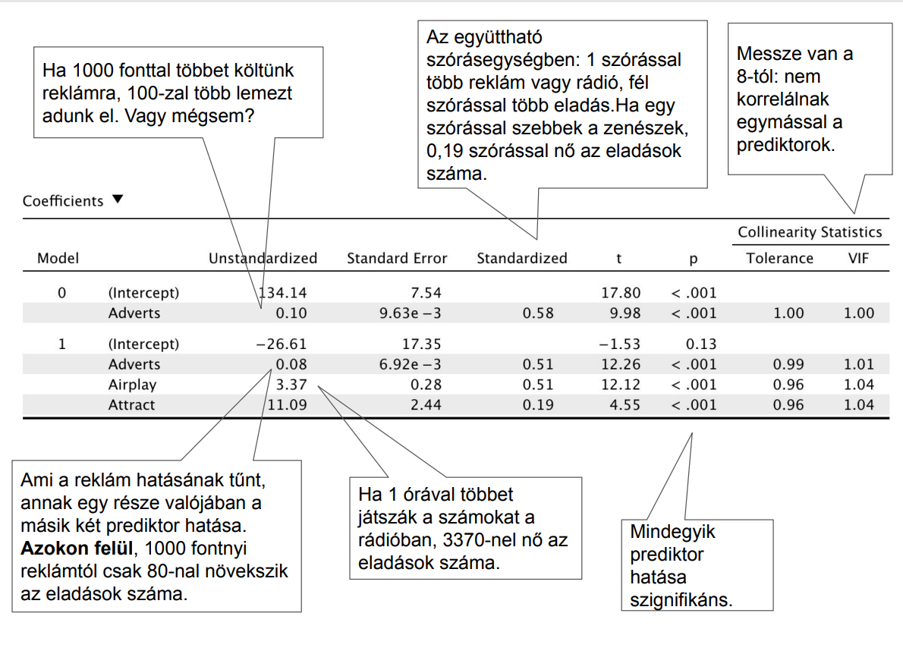

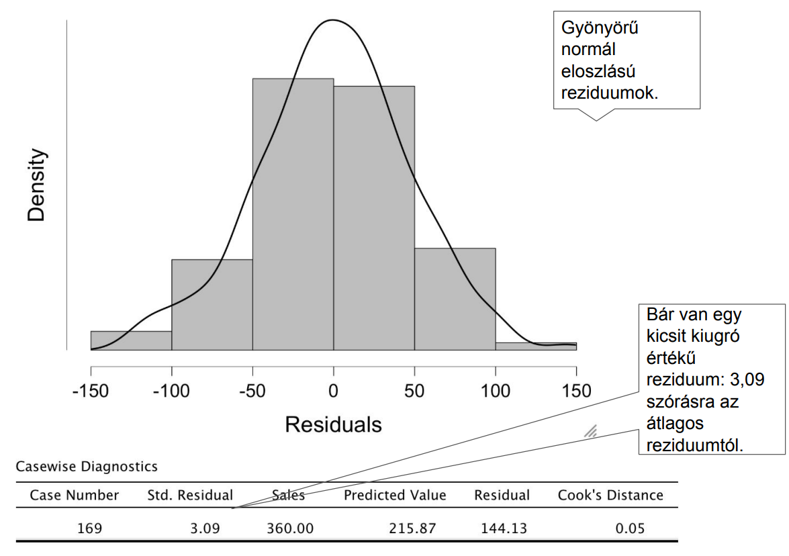

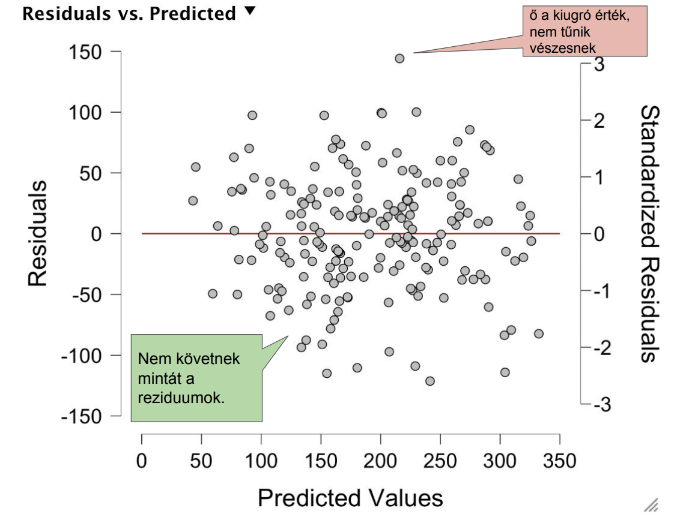

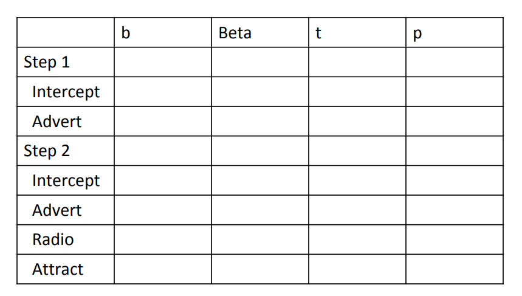

_________________

## Osztályozás gépi tanulási módszerekkel
Források:  
MI_09_Gépi_tanulás.pdf  
MI_10_classification.ipynb

TANULÓ ÁGENSEK
- A megfigyeléseket nem csak a jelenlegi cselekvés meghatározására használja, hanem 
a jövőbeli cselekvések fejlesztésére is
- Az ágens többféle komponense fejleszthető különféle tanulási módszerekkel 
(önvezető autó példáján):
- Feltétel-cselekvés szabályok megfigyelése (milyen körülmények közt fékez az emberi sofőr)
- Objektumfelismerés példák alapján (hogy néz ki egy busz)
- Cselekvések hatásainak megtapasztalása (ha csúszós az út, hosszabb a féktáv)
- Hasznosságfüggvény pontosítása visszajelzések alapján (utasok értékelik az utazási élményt)

GÉPI TANULÁS ALOSZTÁLYAI 
- Feladattípusok szerint: 
- Függvényközelítés (regresszió) 
- **Osztályozás** (classification) 
- Címkézés (labeling) 
- Klaszterezés 
- Példagenerálás (szöveg, kép, stb.) 
- Tanítás módja szerint: 
- Felügyelt tanulás (supervised) 
- Nem felügyelt tanulás (unsupervised)
- Megerősítéses tanulás (reinforcement)

**????**  
TÉTEL KIEGÉSZÍTÉSE! 

_________________

## Mesterséges neurális hálózatok számítási modellje és tanítása
Források: MI_11_02_neural_networks.ipynb  

**????**  
TÉTEL KIEGÉSZÍTÉSE! 
_________________