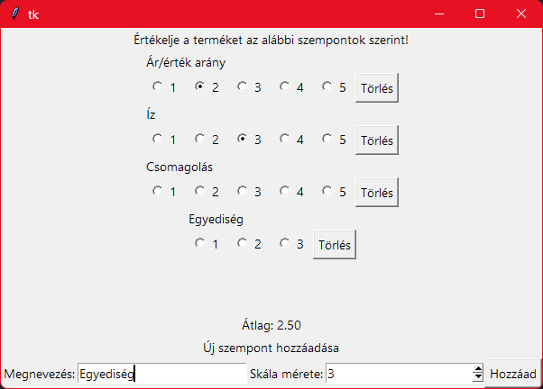

Egészítsd ki a megadott értékelő appot!

Készítsd el a Rating osztály implementációját és egészítsd ki az App osztályt, hogy megfelelően működjenek a funkciók.

A Rating álljon egy szövegből, megadott számú `Radiobutton`ból, melyekből legfeljebb egy lehet kiválasztva, és egy Törlés gombból, ami törli a kiválasztást.

A kiírt átlag azonnal frissüljön ha bármely kiválasztás megváltozik.
Az átlag a kiválasztott értékek összege osztva a kiválasztott értékek számával (tehát ahol egy érték sincs kiválasztva, az nem számít bele az átlagba).
Ha egy érték sincs kiválasztva, akkor `-` jelenjen meg az átlag helyett, hogy ne legyen 0-val osztás.

Az alsó panel segítségével lehessen új értékelési kategóriát hozzáadni.

Példa képernyőkép:

