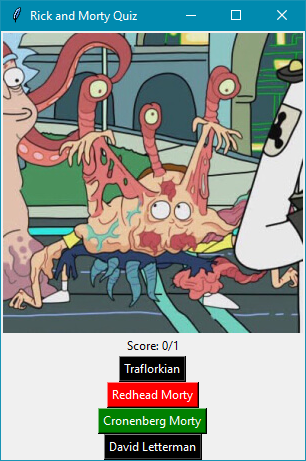

  
Készíts egy Rick and Morty kvízjátékot tkinter és a [Rick and Morty API](https://rickandmortyapi.com/documentation) felhasználásával.

A program indításkor kérje le, hogy hány karakter található a rendszerben.

Ezután sorsoljon ki egy random karaktert, és jelenítse meg a képét.
A példakód segítségül szolgál a JPEG képek letöltésére és megjelenítésére.

A kép alatt jelenjen meg 4 gomb, 4 különböző karakter nevével, melyk közül az egyik (random) gomb a helyes válasz.

Gombnyomásra mutassa meg a helyes választ, majd 3 mp múlva lépjen tovább a következő feladványra.
Ezalatt az idő alatt ne lehessen válaszokat leadni!

A várakozást érdemes egy külön szálon végezni, mert ha a GUI szál blokkolva van, akkor nem reagál semmire (ablak mozgatása, átméretezése, bezárása).

Az ablakban jelenjen meg az eddig elért eredmény is, helyes/összes formátumban.

Példa kinézet:

