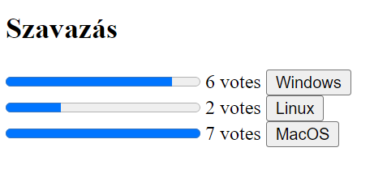
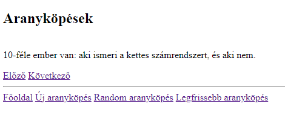
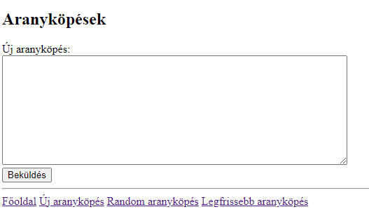

### 1. feladat

Készíts egy szavazatszámláló flask appot.

Hozz létre egy fájlt a szavazati lehetőségekkel, és a szavazatok számát is fájlban tárold (ugyanebben van egy külön fájlban).

A főoldalon jelenjenek meg a lehetőségek nevei, a szavazatok darabszámai és az arányuknak megfelelő progress bar-ok, továbbá szavazó gombok minden váláaszlehetőséghez.

Szavazás után frissüljenek a darabszámok a nézeten.

(Azzal nem kell foglalkozni, hogy egy felhasználó akármennyi szavazatot tud leadni.)

Példa:

### 2. feladat

Készíts aranyköpés-gyűjtő flask appot.

A főoldalon jelenjen meg a beküldött aranyköpések száma, és a navigációs linkek, melyek minden oldalon megegyeznek: "Főoldal", "Új aranyköpés", "Random aranyköpés", "Legfrissebb aranyköpés".
Ehhez használj template öröklődést!

Az egyes aranyköpések a "/<id>" URL-en legyenek elérhetőek. Jelenjen meg az aranyköpés szövege, valamint linkek az előző és következő aranyköpésre (csak ha van).

Az Új aranyköpés oldalon legyen egy textarea és egy Beküldés gomb. Ha a szöveg üres, vagy csak whitespace karakterekből áll, ne kerüljön mentésre. Különben beküldés után töltsön be az új aranyköpés oldala.

