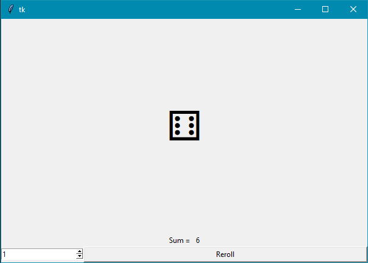
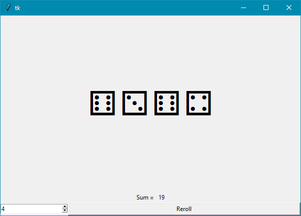
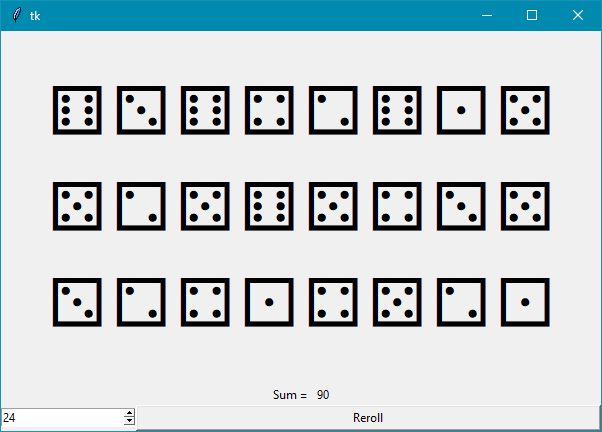

Készíts egy tkinter applikációt kockadobások szimulációjához!

A dobások eredményei egy Label-ben jelenjenek meg, Unicode karakterekkel: `"⚀", "⚁", "⚂", "⚃", "⚄", "⚅"`

Alatta lehessen megadni a dobókockák számát, és egy gombbal lehessen végrehajtani a kockadobásokat.
Induláskor a kockák száma legyen 1, és 

A dobókockák számát egy Spinbox-szal lehessen változtatni.
Az érték léptetésekor automatikusan jelenjen meg vagy tűnjön el egy kocka az eredmény Label-ről.

Az ablak legyen 600x400 méretű, és sok kocka esetén több sorban jelenjenek meg a dobások.
Az egy sorban elférő kockák száma és a sorok maximális száma tetszőleges, 1-nél nagyobb érték lehet.

A widgetek ne mozduljanak el, ha változik a kockák száma.

Az ablak átméretezése esetén is legalul legyen a spinbox és a Reroll gomb, együtt kitöltve az ablak szélességét.
Felettük középen jelenjen meg a dobások összege, ami automatikusan frissüljön.

Néhány példa képernyőkép:

